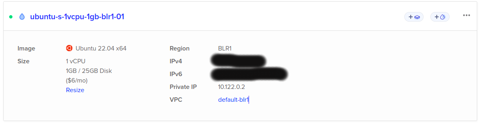
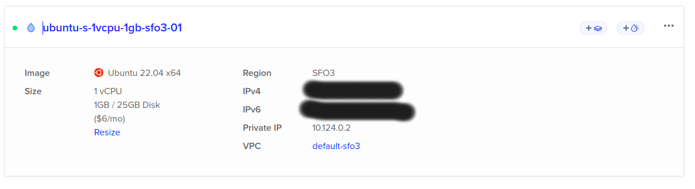

# IPFS Gateway Research

## Context and Scope

Frequency enables network partners to exchange data in a decentralized manner. This entail IPFS services, which are used to store and retrieve data. The purpose of this research document is to perform a study on the IPFS gateway service, given pinned files on the IPFS network can take a while before they are available via gateway services like infura, cloudflare, or other services. In this document we will study the following aspects:
    - Average throughput of the gateway service.
    - Average latency of the gateway service.
    - Results for pinned files on the IPFS network for smaller and larger files.

## Background

Various http gateways backing IPFS network can be found [here](https://ipfs.github.io/public-gateway-checker/) and [here](https://luke.lol/ipfs.php). While the scope of this study is not to evaluate the thoroughness of the gateway services, it is to evaluate the performance of the gateway services.
For this research we choose to use the [infura](https://infura.io/) and [cloudflare](https://www.cloudflare.com/) gateways.

## Criteria

At time of this study following active gateways were evaluated from the list obtained from [here](https://ipfs.github.io/public-gateway-checker/). The list only included gateways with verified origin IP addresses.

| Gateway|
|-------|
| [CF](https://cf-ipfs.com)|
| [CloudFare](https://cloudflare-ipfs.com)|
| [Infura](https://infura-ipfs.io)|

Following measurements were performed on the following gateways:

* Average latency i.e. time to availability.
* Average throughput i.e. bytes per second to download a file which includes latency.
* Check for content-length in response header.
* Any download failures were observed when test script was run few times.

### IPFS Node Setup

Created two IPFS node as digital ocean [droplet](https://www.digitalocean.com/droplets)s. One in Bangalore India and another node in San Francisco California.

Following configuration of droplets were to run IPFS node:

Follow this perfect [tutorial](https://medium.com/pinata/how-to-deploy-an-ipfs-node-on-digital-ocean-c59b9e83098e) to setup ipfs node on digital ocean droplet.

Note: The IPFS nodes were not configured to be gateways.

### Files to Pin

Four files  named a, b, c and d with sizes 10MB, 50MB, 150MB and 420MB were pinned on the IPFS network.

## Results

Complete results for respective pinned files are recorded, requests to the IPFS gateway services were made about 15-20 mins after pinning the files to IPFS nodes.

## File A: Size 10MB

Note: 3 Request were made per file per gateway. Requests were made about 30 mins after pinning the files.

|Gateway | Avg Latency (ms) | Avg Throughput (MB/s) | Avg. Throughput with Latency (MB/s)    |Min/Max Download Speed (MB/s)   | Content-length | % Downloads failed |
| ---------------------- | -------------------------- | ----- | ----- | ------------------- | -------------- | ---------------------- |
|  |
| cf-ipfs.com            | 877.33                      | 6.9 | 4.7 | 2.11/10.28                 | Yes             | 0%                     |
| cloudflare-ipfs.com    | 114.33                      | 17.36 | 14.43 | 14.81/21.83                 | Yes             | 0%                     |
| ipfs.infura.io    | 1820                      | 2.57 | 1.788 | 1.93/3.27                 | Yes             | 0%                     |

## File B: Size 50MB

Note: 3 Request were made per file per gateway. Requests were made about 30 mins after pinning the files.

|Gateway | Avg Latency (ms) | Avg Throughput (MB/s) | Avg. Throughput with Latency (MB/s)    |Min/Max Download Speed (MB/s)   | Content-length | % Downloads failed |
| ---------------------- | -------------------------- | ----- | ----- | ------------------- | -------------- | ---------------------- |
|  |
| cf-ipfs.com            | 449.33                      | 19.68 | 16.7 | 18.5/22.5                 | Yes             | 0%                     |
| cloudflare-ipfs.com    | 231                      | 22.22 | 20.767 | 7.52/32.34                 | Yes             | 0%                     |
| ipfs.infura.io    | 1282                      | 9.76 | 7.737 | 2.74/15.65                 | Yes             | 0%                     |

## File C: Size 150MB

Note:

* Larger file downloads are prone to interruption hence we see failures as timeout is forced to be 500 seconds.
* Only 3 request per file per gateway were made.
* Larger files were run in different node sessions to download.
* Requests were made about 30 mins after pinning the files.

|Gateway | Avg Latency (ms) | Avg Throughput (MB/s) | Avg. Throughput with Latency (MB/s)    |Min/Max Download Speed (MB/s)   | Content-length | % Downloads failed |
| ---------------------- | -------------------------- | ----- | ----- | ------------------- | -------------- | ---------------------- |
|  |
| cf-ipfs.com            | 1734.3                     | 7.21 | 6.5 | 1.28/18.91                 | Yes             | 0%                     |
| cloudflare-ipfs.com    | 2312.3                      | 17.6 | 16.7 | 8.03/24.8                 | Yes             | 0%                     |
| ipfs.infura.io    | 1346.3                      | 4.65 | 4.23 | 2.6/11.37                 | Yes             | 33%                     |

## File D: Size 420MB

Note:

* Larger file downloads are prone to interruption hence we see failures as timeout is forced to be 500 seconds.
* Only 3 request per file per gateway were made.
* Larger files were run in different node sessions to download.
* Requests were made about 2-5 Mins after pinning the file and then again an hour after pinning.

|Gateway | Avg Latency (ms) | Avg Throughput (MB/s) | Avg. Throughput with Latency (MB/s)    |Min/Max Download Speed (MB/s)   | Content-length | % Downloads failed |
| ---------------------- | -------------------------- | ----- | ----- | ------------------- | -------------- | ---------------------- |
|  |
| cf-ipfs.com            | 393.3                     | 27.2 | 26.49 | 26.7/27.9                 | Yes             | 0%                     |
| cloudflare-ipfs.com    | 106                      | 28.87 | 28.65 | 28/30                 | Yes             | 0%                     |
| ipfs.infura.io    |-                      |- | - | -                 | -             | 100%                     |

## Additional Tests

### Typical droplet speeds

* Download: 865.72 Mbit/s
* Upload: 880.97 Mbit/s

### Test Performed

* One IPFS nodes were spun and files were pinned to the node.
* Script uploaded to ipfs and instantly query cloudflare to cat the file and time taken to availability.
* A local gateway was setup using Cloudflare and IROH experimental ipfs hosting in rust and time to download was recorded as an average.

## [IROH](https://github.com/n0-computer/iroh/) - IPFS Resource Optimized Hosting

Files were generate with garbage content and were pinned to IPFS node with sizes around 420 MB x 10 files

Files were pinned against a self hosted IPFS node on digital ocean and the retrieval gateway was hosted on different machine with IROH based experimental gateway.

| File Size | Number of Files | Time to Upload | Time to Availability | Time to Download
| ---------- | ---------------- | -------------- | ------------------ | ------------------ |
| 420MB      | 10               | ~493.679ms          | ~74ms-100ms    | ~35 secs

## References

http://www.eecs.qmul.ac.uk/~tysong/files/IPFS22.pdf
https://news.ycombinator.com/item?id=32736239
